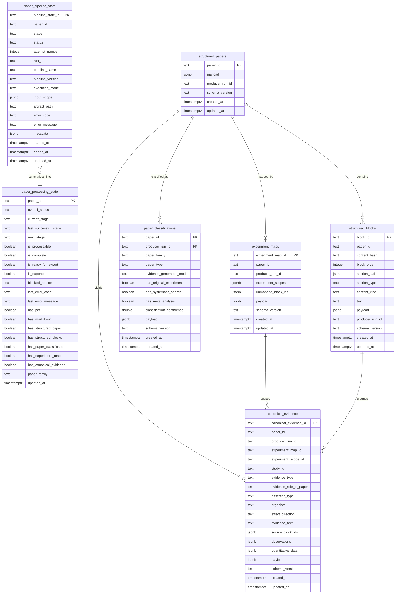

# PostgreSQL Schema

`ops/sql/005_simplified_postgres_schema.sql` is the active schema source.

PostgreSQL stores durable scientific outputs, per-attempt pipeline state, and a
derived per-paper dashboard state. Trimmed evidence blocks are derived in
memory from structured paper content. Detailed events and artifact manifests
remain local JSON/JSONL artifacts.
